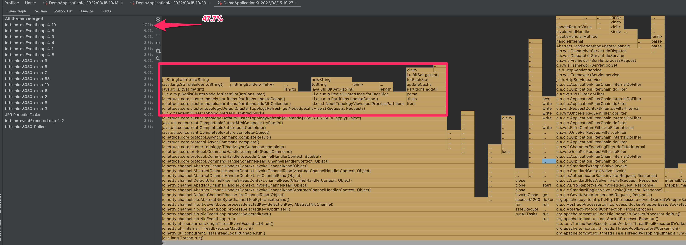

# lettuce-with-large-cluster

## Problem

For Redis Cluster with a large number of nodes, using [enablePeriodicRefresh](https://github.com/lettuce-io/lettuce-core/blob/a462cc1ca2dc009f8d1ea3d7af8fd3614348b077/src/main/java/io/lettuce/core/cluster/ClusterTopologyRefreshOptions.java#L258) causes
performance problems.

## Reproduction Steps

### 1. Run Redis Cluster using Docker

```bash
# Run 96 nodes' redis cluster 
$ docker-compose up
```

### 2. Run application with enablePeriodicRefresh and apply a little load

```bash
# Run application
$ ENABLE_REFRESH=true ./gradlew clean bootRun
```

```bash
# I use vegeta as stress test tool.
# https://github.com/tsenart/vegeta

$ echo "GET http://localhost:8080/test" | vegeta attack -rate=10 -duration=120s | vegeta report
Requests      [total, rate, throughput]         1200, 10.01, 10.01
Duration      [total, attack, wait]             2m0s, 2m0s, 9.08ms
Latencies     [min, mean, 50, 90, 95, 99, max]  2.961ms, 705.952ms, 5.445ms, 3.21s, 6.148s, 8.488s, 9.059s
Bytes In      [total, mean]                     2400, 2.00
Bytes Out     [total, mean]                     0, 0.00
Success       [ratio]                           100.00%
Status Codes  [code:count]                      200:1200
```

You can see that 99 percentile and max latency are very bad.

### 3. Run application with disablePeriodicRefresh and apply a little load

```bash
# Run application
$ ENABLE_REFRESH=false ./gradlew clean bootRun
```

```bash
$ echo "GET http://localhost:8080/test" | vegeta attack -rate=10 -duration=120s | vegeta report
Requests      [total, rate, throughput]         1200, 10.01, 10.01
Duration      [total, attack, wait]             2m0s, 2m0s, 3.58ms
Latencies     [min, mean, 50, 90, 95, 99, max]  2.993ms, 6.698ms, 5.035ms, 10.802ms, 14.66ms, 30.921ms, 65.482ms
Bytes In      [total, mean]                     2400, 2.00
Bytes Out     [total, mean]                     0, 0.00
Success       [ratio]                           100.00%
Status Codes  [code:count]                      200:1200
```

You can see that there is no performance problem.

### (One more thing: using small Redis Clusters)

Edit docker-compose.yml.

```
MASTERS: 48
↓
MASTERS: 3
```

Then, run application with enablePeriodicRefresh and apply a little load.

```bash
# Run application
$ ENABLE_REFRESH=true ./gradlew clean bootRun
```

```bash
$ echo "GET http://localhost:8080/test" | vegeta attack -rate=10 -duration=120s | vegeta report
Requests      [total, rate, throughput]         1200, 10.01, 10.01
Duration      [total, attack, wait]             2m0s, 2m0s, 5.76ms
Latencies     [min, mean, 50, 90, 95, 99, max]  2.788ms, 11.774ms, 5.683ms, 12.409ms, 15.522ms, 53.628ms, 1.009s
Bytes In      [total, mean]                     2400, 2.00
Bytes Out     [total, mean]                     0, 0.00
Success       [ratio]                           100.00%
Status Codes  [code:count]                      200:1200
Error Set:
```

Max latency is a bit slow, but it's almost no problem.

## Cause (I think)

Looking at the framegraph, we can see that the lettuce-nioEventLoop thread is consuming a lot of CPU time with
`DefaultClusterTopologyRefresh.getNodeSpecificViews`.

It seems that the redis commands are affected because the lettuce-nioEventLoop thread is doing the
long-time-consuming processing.



In fact, the time taken for this process is over 1000ms. This is a big problem with event loop threads.

https://github.com/lettuce-io/lettuce-core/blob/35508b06def17800e81f626c5c58b6b03a50d7f2/src/main/java/io/lettuce/core/cluster/topology/DefaultClusterTopologyRefresh.java#L110

```java
...
long started = System.currentTimeMillis();
NodeTopologyViews views = getNodeSpecificViews(requestedTopology, requestedInfo);
logger.info("elapsed: {}ms", System.currentTimeMillis() - started); // elapsed: 1229ms
...
```

## Solution

### Idea 1

Stop running `DefaultClusterTopologyRefresh.getNodeSpecificViews` on the NIO event loop.

I won't go into details, but if I customized `DefaultClusterTopologyRefresh` and ran it on another thread, the
performance improved.

My team is considering adopting this method as a workaround.

### Idea 2

Looking at the previous framegraph, it seems that the overhead is large in the processing using BitSet.
Why not change to a more primitive method like `boolean[]` ?

However, I'm not sure if the performance will improve.
